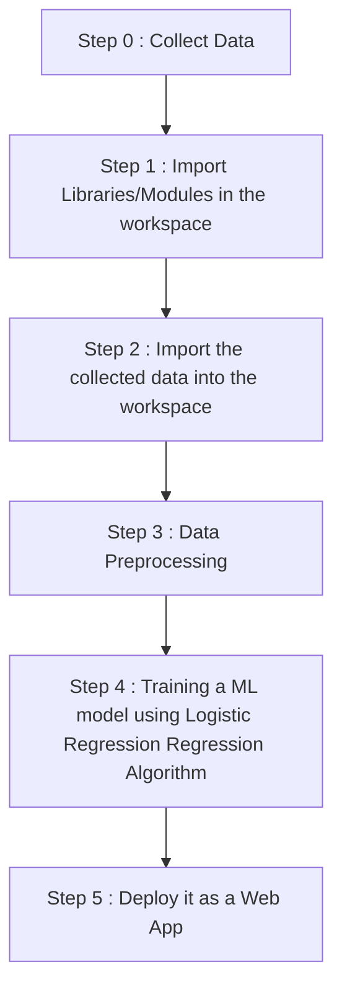

# Diabetes-Prediction-Web-App-using-Streamlit
This is a Machine Learning project of Diabetes Prediction which is deployed as a Web App using Streamlit Cloud.

Link to the web app : https://dvamsidhar2002-diabetes-pred-diabetes-prediction-web-app-3c1wfu.streamlit.app/

<h2 align='center'>WORKFLOW OF THE PROJECT</h2>

